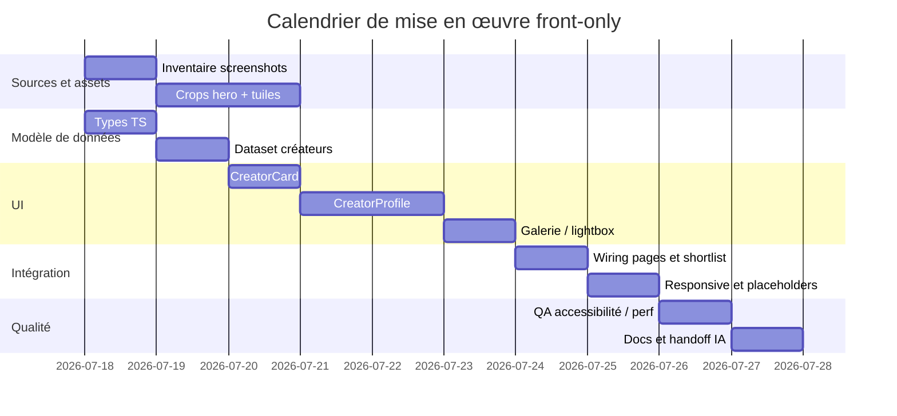

# Plan de production pour des cartes créateurs interactives et des profils media-kit normalisés pour une agence d’influence maritime

## Résumé exécutif

À partir des 12 captures fournies, le roster de départ représente **12 créateurs confirmés**, **434 623 abonnés Instagram visibles** et **9 684 publications visibles**. Le principal défaut du dispositif actuel n’est pas le manque de preuves, mais **la nature de la preuve affichée** : l’interface publique expose encore des captures d’écran Instagram complètes, avec chrome applicatif, boutons d’abonnement, stories, icônes système et mises en page hétérogènes. Pour une audience de marques et d’entreprises, cela affaiblit la perception de maîtrise, de cohérence et de fiabilité. La bonne trajectoire consiste à **sortir les captures de l’interface publique** et à les conserver dans un dossier d’**evidence** interne, tout en publiant à leur place des **crops éditorialisés**, des **métriques étiquetées par statut**, et des **profils media-kit normalisés**. Cette séparation est également cohérente avec les exigences de transparence de l’influence commerciale et avec le fait que Meta indique que certaines métriques d’insights sont elles-mêmes « estimées » et réservées aux comptes professionnels. citeturn5search2turn5search8turn1search1turn1search10

La recommandation opérationnelle est la suivante : **un seul fichier de données centralisé**, **deux composants React stateless** (`CreatorCard` et `CreatorProfile`), **un pipeline d’assets dérivés** (hero crop + 3 tuiles par créateur), et **une taxonomie stricte des statuts de métriques** : `Vérifié`, `Fourni par le créateur`, `Estimation indicative`, `Données en attente`. Dans la V1 front-only, le site doit afficher des profils **brand-ready**, mais ne jamais présenter comme “réel” ou “certifié” un volume de vues qui ne provient pas d’un dashboard professionnel, d’un export first-party ou d’un outil d’audit tiers revérifié. Meta précise en effet que l’accès aux insights exige un compte créateur/professionnel et que certaines métriques sont estimées ; cela justifie un système de labels visible côté UI. citeturn5search2turn5search8turn5search11

D’un point de vue technique, la base recommandée est compatible avec un projet **React partagé entre Next et Vite** : les composants restent agnostiques via une abstraction d’image, mais si le projet tourne sous Next, il faut exploiter `next/image`, `sizes`, `preload`, `loading`, et des images responsives correctement dimensionnées. Next.js exige `alt`, recommande l’usage de `sizes` pour les layouts responsives, et web.dev rappelle que le LCP ne doit pas être lazy-loadé au-dessus de la ligne de flottaison. Côté accessibilité, les cartes, lightboxes et CTA doivent respecter les règles WAI/WCAG : texte lisible, focus visible, cibles d’au moins 24×24 px, contraste minimal de 4,5:1 et dialogue modal correctement piégé au clavier. citeturn2search2turn9search0turn9search7turn3search0turn8search3turn8search4turn2search0turn1search3

## Audit normalisé des créateurs

Le tableau ci-dessous est fondé sur **la lecture manuelle des captures fournies**. Les colonnes “abonnés” et “publications” correspondent uniquement aux chiffres visibles dans les screenshots. Les estimations de vues 30 jours sont des **plages provisoires de planning** ; elles ne sont pas des vérités de campagne. La seule valeur réellement vérifiée sur 30 jours fournie dans vos captures est, à ce stade, **Best Boat Deals : 2,6 M vues sur 30 jours** via le dashboard professionnel.

| Nom canonique proposé | Handle Instagram | Abonnés visibles | Publications visibles | Preuve visuelle exploitable | Estimation provisoire vues 30 j | Statut métrique | Crop hero recommandé | 3 tuiles suggérées |
|---|---|---:|---:|---|---|---|---|---|
| Can Hicyilmaz | `@canhicyilmaz` | 155 K | 1 089 | Capture `15.12.07` : header profil lisible, nom “Can Hicyilmaz”, 155 K followers, 1 089 publications | **0,6 M–1,5 M** | Estimation indicative | **4:5**, focale visage + cockpit, privilégier la tuile bas-gauche en conservant eau + épaules | **T1** vidéo 4:5, cockpit/maintenance ; **T2** photo 1:1, corde/teck ; **T3** vidéo 4:5, portrait assis à bord |
| Bonita Herewane | `@sailing_nandji` | 74,1 K | 2 940 | Capture `15.12.13` : nom visible “Bonita Herewane”, 74,1 K followers, 2 940 publications | **0,35 M–0,9 M** | Estimation indicative | **4:5**, portrait selfie central, mer + lumière chaude | **T1** photo verticale, voilier vu du dessus ; **T2** photo 1:1, selfie/famille à bord ; **T3** photo 4:5, femme au pied du mât |
| Cyril & Magalie | `@cyril_et_magalie` | 15,2 K | 1 764 | Capture `15.12.21` : handle lisible, nom profil “CATAMARAN BLACKLION”, 15,2 K followers, 1 764 publications | **0,12 M–0,35 M** | Estimation indicative | **4:5**, focale humaine sur la tuile haut-centre avec enfants / visage | **T1** photo paysage, baie montagneuse ; **T2** photo 4:5, scène familiale ; **T3** photo aérienne 1:1, lagon/reef |
| Sailing Magic Carpet | `@sailingmagiccarpet` | 60 K | 404 | Capture `15.12.28` : nom profil “SailingMagicCarpet”, 60 K followers, 404 publications | **0,30 M–0,9 M** | Estimation indicative | **4:5**, intérieur chaleureux bateau + deux personnes, focale centre-gauche | **T1** photo intérieure éditoriale ; **T2** vidéo 4:5 “boat tour” ; **T3** photo 4:5 au mouillage / plage |
| Mégane Salmon | `@meg_slmn` | 28,6 K | 1 663 | Capture `15.12.34` : handle lisible, 28,6 K followers, 1 663 publications, lien `meganesalmon` visible | **0,18 M–0,6 M** | Estimation indicative | **4:5**, verticale plongée sur mur/récif, sujet humain centré | **T1** photo 4:5, raies/ban de poissons ; **T2** photo/vidéo verticale, plongeuse + grand animal ; **T3** photo 4:5, nage en surface turquoise |
| Mathilde | `@la_liste_de_mathilde` | 10,1 K | 80 | Capture `15.12.40` : nom “Mathilde”, 10,1 K followers, 80 publications | **0,07 M–0,22 M** | Estimation indicative | **4:5**, portrait “Recap Part 1” haut-gauche, visage + mer | **T1** vidéo portrait recap ; **T2** photo 4:5 maintenance/ponton ; **T3** vidéo 4:5 vie à bord / cuisine |
| Adrien Cazanave | `@best_boat_deals` | 39,1 K | 466 | Capture `15.12.45` : nom “Adrien Cazanave”, 39,1 K followers, 466 publications, **dashboard pro 2,6 M vues / 30 jours** | **2,6 M** | Vérifié | **4:5**, portrait en talking-head si proprement recadré, sinon voile/bateau haut-droite | **T1** vidéo port/bateau avec prix à neutraliser visuellement si possible ; **T2** vidéo face-cam expert ; **T3** photo 4:5 voilier/annonce |
| Alessio Pandolfi | `@alessiopdlf.nautic` | 207 | 5 | Capture `15.12.58` : nom “Alessio Pandolfi | Nautique”, 207 followers, 5 publications, vues visibles **5 573 / 32,6 K / 11,4 K** sur 3 reels | **0,035 M–0,08 M** | Estimation indicative | **4:5**, haut-gauche bateau abandonné au port, conserver coque + mât | **T1** vidéo 4:5 bateau au port ; **T2** vidéo portrait 4:5 sujet parlant ; **T3** photo 1:1 cartographie bassin/Arcachon |
| Captain Redgi | `@captain.redgi` | 26,3 K | 241 | Capture `15.13.06` : profil “REGINA | delivery boats | sailing trips”, 26,3 K followers, 241 publications | **0,16 M–0,5 M** | Estimation indicative | **4:5**, haut-gauche portrait souriant sur pont, drapeau/cockpit | **T1** vidéo 4:5 talking-head “my services” ; **T2** photo 4:5 voile colorée / annonce bateau ; **T3** vidéo 4:5 navigation de nuit / feu d’artifice si utile section lifestyle |
| Thomas Debierre | `@thomas_dbrr` | 7 697 | 777 | Capture `15.13.10` : nom lisible “Thomas Debierre”, 7 697 followers, 777 publications | **0,06 M–0,18 M** | Estimation indicative | **4:5**, grosse vague/surf, garder sujet dans le tube | **T1** photo 4:5 surf action ; **T2** photo 1:1 couverture/title poster si propre ; **T3** photo 4:5 plage/tropical |
| Antoine Fernandez | `@antoine_fernandezh` | 14,1 K | 99 | Capture `15.13.14` : nom “Antoine Fernandez”, 14,1 K followers, 99 publications | **0,10 M–0,30 M** | Estimation indicative | **4:5**, haut-droite face-cam sur pont, casquette + voilier | **T1** photo coucher de soleil/mer ; **T2** vidéo 4:5 mât/voile ; **T3** portrait 1:1 visage serré |
| Les Topos d’un Boc | `@les_topos_dun_boc` | 4 219 | 156 | Capture `15.13.18` : nom “Les Topos d’un Boc | Voile & bateaux”, 4 219 followers, 156 publications | **0,025 M–0,09 M** | Estimation indicative | **4:5**, bas-centre talking-head pédagogique | **T1** photo catamaran 4:5 ; **T2** vidéo talking-head 4:5 ; **T3** photo 4:5 intérieur bateau / cockpit |

**Lecture stratégique du roster.** Les captures montrent une matière éditoriale riche mais visuellement hétérogène : contenus human-centric, plongée, voile hauturière, pédagogie, surf, livraison de bateaux, deals/transactions. C’est un avantage commercial, à condition de le normaliser dans une UI cohérente. Pour les profils comme `@meg_slmn`, `@sailing_nandji`, `@sailingmagiccarpet` et `@canhicyilmaz`, la matière image est suffisamment forte pour produire des cartes “premium” dès la V1 sans inventer d’assets. Pour les profils plus faibles en volume ou plus text-overlay-heavy (`@alessiopdlf.nautic`, `@best_boat_deals`), il faut accepter une **placeholder strategy contrôlée** jusqu’à réception de visuels natifs. Les outils d’analyse comme Modash, Kolsquare et HypeAuditor sont précisément conçus pour compléter ces signaux publics par des vues moyennes, taux d’engagement, démographie d’audience et crédibilité du profil. citeturn7search0turn7search4turn7search6turn10search1turn10search5turn6search14

## Spécification des cartes interactives et profils media-kit

La carte créateur doit cesser d’être un “screenshot card” et devenir un **bloc éditorial cliquable**, hiérarchisé et compatible B2B. Le rôle de la carte n’est pas de reproduire Instagram mais de permettre à une marque de répondre vite à trois questions : **qui est le créateur**, **quelle taille d’audience visible a-t-il**, et **pour quel type de campagne est-il crédible**. Les composants devront donc privilégier une image maîtrisée, deux métriques maximum, un statut métrique explicite, et une conversion claire vers la sélection ou le profil complet. Cette approche est cohérente avec les bonnes pratiques de responsive images et de performance : fournir plusieurs sources via `srcset`/`sizes`, laisser le navigateur choisir la ressource la plus adaptée, ne pas lazy-loader le visuel LCP, et utiliser `preload`/`fetchpriority` pour l’image critique au-dessus de la ligne de flottaison. citeturn3search0turn3search1turn2search2turn9search0turn9search3turn9search6

```mermaid
flowchart TD
  A[Zone média 4:5] --> B[Catégorie + badge statut]
  B --> C[Nom canonique]
  C --> D[@handle]
  D --> E[Positionnement en 1 ligne]
  E --> F[2 métriques maximum]
  F --> G[CTA Profil]
  F --> H[CTA Ajouter à la sélection]
```

**Spécification visuelle recommandée.**

| Élément | Desktop | Tablet | Mobile |
|---|---|---|---|
| Largeur carte | 360 px fixe en grille 3 colonnes | 320 px en grille 2 colonnes | 100% de la colonne, max 420 px |
| Hauteur carte | 608 px | 576 px | auto |
| Zone média | 360×450 px, ratio **4:5** | 320×400 px, ratio **4:5** | ratio **4:5** conservé |
| Avatar secondaire | 56×56 px | 52×52 px | 48×48 px |
| Zone texte | min-height 158 px | min-height 156 px | min-height 148 px |
| CTA primaire | 44 px min height | 44 px | 48 px |
| Gutter grille | 24 px | 20 px | 16 px |

**Typographie recommandée.**

| Token | Usage | Valeur |
|---|---|---|
| `--font-display` | Titres de cartes / hero profils | `"Inter Tight", "Inter", system-ui, sans-serif` |
| `--font-body` | Texte / labels / badges | `"Inter", system-ui, sans-serif` |
| `--text-display-xl` | Nom profil hero | `clamp(3rem, 7vw, 6rem)` / `700` / `0.92` |
| `--text-h2` | Nom carte | `2rem` / `700` / `1.02` |
| `--text-body-lg` | Positionnement | `1.125rem` / `500` / `1.45` |
| `--text-body-sm` | Labels métriques | `0.875rem` / `500` / `1.4` |
| `--text-meta-xs` | Statuts / tags | `0.75rem` / `600` / `1.25` / uppercase opt. |

**Couleurs et tokens recommandés.** Les couples texte/fond utilisés pour le body et les CTA doivent être testés au minimum contre le seuil WCAG **4,5:1** pour le texte standard ; les zones de hit interactives doivent rester au moins à **24×24 px**, idéalement 44×44 px côté tactile. citeturn8search3turn8search4

| Token | Valeur | Usage |
|---|---:|---|
| `--ink-950` | `#06131B` | Fond principal |
| `--ink-900` | `#0B1D2A` | Cartes sombres / surface |
| `--ink-800` | `#132A3C` | Bordures / overlays |
| `--line-700` | `#214156` | Diviseurs |
| `--text-0` | `#F7FAFC` | Texte sur fond sombre |
| `--text-1` | `#D5E2EA` | Texte secondaire |
| `--text-2` | `#90A7B8` | Métadonnées |
| `--surface-0` | `#FFFFFF` | Fond clair carte |
| `--surface-1` | `#F4F7F9` | Fonds secondaires |
| `--accent-500` | `#8FE7DE` | CTA primaire / focus ring doux |
| `--accent-600` | `#57D5C7` | Hover CTA |
| `--brand-500` | `#0F6BFF` | Liens / accents techniques |
| `--warning-500` | `#F1C453` | Badge “Estimation indicative” |
| `--success-500` | `#31C48D` | Badge “Vérifié” |

**Micro-interactions recommandées.**

| État | Règle |
|---|---|
| Hover carte | `transform: translateY(-4px)` ; ombre de `0 8px 24px rgba(5,18,27,.12)` à `0 18px 42px rgba(5,18,27,.18)` |
| Hover média | Scale image `1.03` max, durée `220ms`, easing `cubic-bezier(.2,.8,.2,1)` |
| Hover badge | Aucune animation “flashy” ; simple fond + légère élévation |
| Press | `scale(.985)` sur bouton |
| Focus clavier | Anneau visible `2px` accent + `outline-offset: 2px` |
| Skeleton/placeholder | shimmer discret 1,2–1,6 s, jamais sur le hero LCP |
| Motion reduced | désactiver translate/scale, conserver seulement transitions d’opacité |

**Règles d’accessibilité.** Toutes les images informatives doivent avoir un `alt` non vide ; les éléments purement décoratifs peuvent utiliser `alt=""` ou un rôle décoratif, mais jamais pour des contrôles interactifs. Les lightboxes doivent suivre le pattern WAI “dialog modal” : `role="dialog"`, `aria-modal="true"`, focus piégé dans la fenêtre, fermeture possible par `Escape`, et bouton de fermeture accessible. Les tooltips ne doivent pas contenir de contenu interactif ; si un popup contient de l’interaction, il doit être traité comme un dialogue non modal ou modal. citeturn1search3turn1search4turn2search0turn2search6turn1search11

**Optimisation image et lazy-loading.** Pour les assets créateurs, le pipeline recommandé est : **AVIF** en premier choix, **WebP** en second, **JPEG** seulement en fallback ou pour preuve interne. Les widths à générer sont : cartes `320, 480, 640, 768`; hero profil `640, 960, 1280, 1600`; tuiles galerie `240, 480, 720`. Les cartes et tuiles sous la ligne de flottaison doivent utiliser `loading="lazy"` ; l’image hero du profil et l’image principale du hero home doivent être `loading="eager"` / `preload` / `fetchpriority="high"`. Les dimensions intrinsèques ou `aspect-ratio` doivent être fixées pour éviter le CLS. citeturn2search2turn9search0turn9search4turn9search7turn9search6

**Règle de placeholder.** Si aucun crop propre n’existe encore, on dérive un crop local depuis la capture et on l’affiche avec un overlay discret “Visuel éditorial provisoire”. On **n’affiche jamais la capture Instagram complète** comme carte publique dans la version améliorée. Si trois tuiles ne sont pas prêtes, on garde la structure de galerie mais on rend des placeholders visuels au ratio correct, avec libellés de formats. Cette règle est importante pour éviter de confondre “preuve de sourcing” et “matière créative”. 

## Modèle de données et API React

Le cœur du dispositif doit être un **fichier de données unique**, lu à la fois par la grille, les pages profil, la shortlist et le builder de campagne. Cette centralisation évite les divergences entre cartes et profils, et prépare l’extension future vers un CMS ou vers Supabase. Les outils d’audit comme Modash et Kolsquare existent précisément pour enrichir ce type de fiche avec audience, engagement, vues moyennes et crédibilité ; le modèle de données doit donc être prêt à accueillir ces champs même si leur valeur est encore vide en V1. citeturn7search0turn7search4turn7search5turn10search1

```ts
export type MetricStatus =
  | "verified"
  | "creator_provided"
  | "estimated"
  | "pending";

export type PlatformName = "instagram" | "youtube" | "tiktok" | "facebook";

export interface PlatformStat {
  platform: PlatformName;
  handle: string;
  url: string;
  followers?: number;
  publications?: number;
  engagementRate?: number | null;
  avgViews30d?: {
    min?: number | null;
    max?: number | null;
    exact?: number | null;
    status: MetricStatus;
    source: "screenshot" | "dashboard" | "creator_pdf" | "third_party" | "internal_model";
    verifiedAt?: string | null;
    note?: string | null;
  };
}

export interface MediaAsset {
  id: string;
  kind: "image" | "video";
  role: "hero" | "tile" | "gallery" | "avatar" | "evidence";
  src: string;
  alt: string;
  width: number;
  height: number;
  cropRatio: "1:1" | "4:5" | "3:4" | "16:9" | "9:16";
  focalPoint?: { x: number; y: number }; // 0..1
  placeholder?: {
    blurDataURL?: string;
    background?: string;
    label?: string;
  };
  sourceEvidence?: string;
}

export interface AudienceData {
  topCountries?: Array<{ country: string; share: number }>;
  ageBands?: Array<{ band: string; share: number }>;
  genderSplit?: Array<{ label: string; share: number }>;
  storyReachAvg?: number | null;
  reelViewsAvg?: number | null;
  status: MetricStatus;
  source?: "creator_export" | "third_party" | "pending";
}

export interface CampaignFit {
  verticals: string[];
  formats: string[];
  deliverables: string[];
  useRights: string[];
  strengths: string[];
  availability: "available" | "limited" | "on_request";
  languages: string[];
  operatingRegions: string[];
}

export interface Creator {
  id: string;
  handle: string;
  displayName: string;
  legalOrPublicName?: string | null;
  headline: string;
  oneLiner: string;
  bioShort: string;
  categories: string[];
  tags: string[];
  metricStatus: MetricStatus;
  verifiedAt?: string | null;
  evidenceSummary: string;
  screenshotFile: string;

  platforms: PlatformStat[];
  audience: AudienceData;
  fit: CampaignFit;

  media: {
    hero: MediaAsset;
    tiles: [MediaAsset, MediaAsset, MediaAsset];
    gallery: MediaAsset[];
    evidence: MediaAsset[];
  };

  relatedCreatorIds: string[];
}
```

**Exemple JSON pour un créateur, dérivé des captures fournies.**

```json
{
  "id": "can-hicyilmaz",
  "handle": "canhicyilmaz",
  "displayName": "Can Hicyilmaz",
  "legalOrPublicName": "Can Hicyilmaz",
  "headline": "Marin hauturier et créateur de longue distance",
  "oneLiner": "Voile hauturière, vie à bord et pédagogie pratique depuis le SY HASKAP.",
  "bioShort": "Créateur vidéo et marin au long cours, profil crédible pour des campagnes voile, équipement, sécurité et aventure.",
  "categories": ["Voile & vie à bord", "Pédagogie nautique"],
  "tags": ["offshore", "captain", "liveaboard"],
  "metricStatus": "estimated",
  "verifiedAt": "2026-07-15",
  "evidenceSummary": "Capture du profil Instagram montrant 155 K followers et 1 089 publications.",
  "screenshotFile": "/evidence/screenshots/Screenshot 2026-07-15 at 15.12.07.png",
  "platforms": [
    {
      "platform": "instagram",
      "handle": "@canhicyilmaz",
      "url": "https://instagram.com/canhicyilmaz",
      "followers": 155000,
      "publications": 1089,
      "avgViews30d": {
        "min": 600000,
        "max": 1500000,
        "exact": null,
        "status": "estimated",
        "source": "internal_model",
        "verifiedAt": "2026-07-15",
        "note": "Estimation provisoire fondée sur taille de communauté, profil vidéo et fréquence supposée. À remplacer par export Creator Insights."
      }
    }
  ],
  "audience": {
    "status": "pending",
    "source": "pending"
  },
  "fit": {
    "verticals": ["Équipement nautique", "Sécurité", "Électronique marine", "Chantiers navals"],
    "formats": ["Reels", "Stories", "Photo post", "YouTube long-form"],
    "deliverables": ["1 Reel", "1 série de stories", "1 post photo", "usage organique"],
    "useRights": ["organique", "paid media on request"],
    "strengths": ["Crédibilité terrain", "Voix pédagogique", "Longue distance"],
    "availability": "on_request",
    "languages": ["tr", "en"],
    "operatingRegions": ["Méditerranée", "International"]
  },
  "media": {
    "hero": {
      "id": "can-hero",
      "kind": "image",
      "role": "hero",
      "src": "/assets/creators/canhicyilmaz/hero-4x5.avif",
      "alt": "Can Hicyilmaz à bord d’un voilier, cadré cockpit et mer",
      "width": 1280,
      "height": 1600,
      "cropRatio": "4:5",
      "focalPoint": { "x": 0.42, "y": 0.58 },
      "sourceEvidence": "/evidence/screenshots/Screenshot 2026-07-15 at 15.12.07.png"
    },
    "tiles": [
      {
        "id": "can-tile-1",
        "kind": "image",
        "role": "tile",
        "src": "/assets/creators/canhicyilmaz/tile-1-4x5.avif",
        "alt": "Can Hicyilmaz en action de maintenance sur le cockpit",
        "width": 720,
        "height": 900,
        "cropRatio": "4:5"
      },
      {
        "id": "can-tile-2",
        "kind": "image",
        "role": "tile",
        "src": "/assets/creators/canhicyilmaz/tile-2-1x1.avif",
        "alt": "Détail de pont et cordage sur voilier",
        "width": 720,
        "height": 720,
        "cropRatio": "1:1"
      },
      {
        "id": "can-tile-3",
        "kind": "image",
        "role": "tile",
        "src": "/assets/creators/canhicyilmaz/tile-3-4x5.avif",
        "alt": "Can Hicyilmaz assis sur le pont d’un voilier",
        "width": 720,
        "height": 900,
        "cropRatio": "4:5"
      }
    ],
    "gallery": [],
    "evidence": [
      {
        "id": "can-evidence-1",
        "kind": "image",
        "role": "evidence",
        "src": "/evidence/screenshots/Screenshot 2026-07-15 at 15.12.07.png",
        "alt": "Capture source du profil Instagram canhicyilmaz",
        "width": 1536,
        "height": 998,
        "cropRatio": "16:9"
      }
    ]
  },
  "relatedCreatorIds": ["sailing-nandji", "captain-redgi", "sailing-magic-carpet"]
}
```

**API React recommandée.** Les composants doivent rester **stateless** et consommer un dataset centralisé.

```tsx
import * as React from "react";

export type ImageLikeProps = {
  src: string;
  alt: string;
  className?: string;
  sizes?: string;
  loading?: "eager" | "lazy";
  priority?: boolean;
  width?: number;
  height?: number;
};

export type ImageRenderer = React.ComponentType<ImageLikeProps>;

export interface CreatorCardProps {
  creator: Creator;
  href: string;
  locale?: "fr-FR";
  imageRenderer?: ImageRenderer;
  onAddToShortlist?: (creatorId: string) => void;
}

export interface CreatorProfileProps {
  creator: Creator;
  related: Creator[];
  locale?: "fr-FR";
  imageRenderer?: ImageRenderer;
  onAddToShortlist?: (creatorId: string) => void;
  onRequestMediaKit?: (creatorId: string) => void;
}
```

**Exemple de composant `CreatorCard`.**

```tsx
import React from "react";

const DefaultImg: ImageRenderer = ({
  src,
  alt,
  className,
  sizes,
  loading = "lazy",
  width,
  height
}) => (
  
);

function metricLabel(
  stat: PlatformStat["avgViews30d"]
): string {
  if (!stat) return "Données en attente";
  if (stat.status === "verified" && stat.exact) {
    return `${new Intl.NumberFormat("fr-FR").format(stat.exact)} vues / 30 j`;
  }
  if (stat.min && stat.max) {
    return `${new Intl.NumberFormat("fr-FR").format(stat.min)}–${new Intl.NumberFormat("fr-FR").format(stat.max)} vues / 30 j`;
  }
  return "Données en attente";
}

function statusBadge(status: MetricStatus) {
  switch (status) {
    case "verified":
      return "Vérifié";
    case "creator_provided":
      return "Fourni par le créateur";
    case "estimated":
      return "Estimation indicative";
    default:
      return "Données en attente";
  }
}

export function CreatorCard({
  creator,
  href,
  imageRenderer: Img = DefaultImg,
  onAddToShortlist
}: CreatorCardProps) {
  const ig = creator.platforms.find((p) => p.platform === "instagram");
  const hero = creator.media.hero;

  return (
    <article className="group overflow-hidden rounded-[28px] border border-[var(--line-700)] bg-white shadow-sm transition-transform duration-200 hover:-translate-y-1">
      <a href={href} className="block focus:outline-none focus-visible:ring-2 focus-visible:ring-[var(--accent-500)]">
        <div className="relative aspect-[4/5] overflow-hidden bg-[var(--ink-900)]">
          
          <div className="absolute inset-x-0 bottom-0 bg-gradient-to-t from-black/70 to-transparent p-5 text-white">
            <div className="mb-2 flex items-center justify-between gap-3">
              <span className="rounded-full border border-white/20 bg-black/25 px-2.5 py-1 text-[11px] font-semibold uppercase tracking-[0.08em]">
                {creator.categories[0]}
              </span>
              <span className="rounded-full bg-white/10 px-2.5 py-1 text-[11px] font-medium">
                {statusBadge(creator.metricStatus)}
              </span>
            </div>
            <h3 className="text-[28px] font-semibold leading-[1]">{creator.displayName}</h3>
            <p className="mt-1 text-sm text-white/80">@{creator.handle}</p>
          </div>
        </div>
      </a>

      <div className="space-y-5 p-5">
        <p className="min-h-[48px] text-sm leading-6 text-slate-700">{creator.oneLiner}</p>

        <div className="grid grid-cols-2 gap-4 border-t border-slate-200 pt-4">
          <div>
            <div className="text-[28px] font-semibold leading-none text-slate-950">
              {ig?.followers ? new Intl.NumberFormat("fr-FR", { notation: "compact", maximumFractionDigits: 1 }).format(ig.followers) : "n/a"}
            </div>
            <div className="mt-1 text-xs text-slate-500">abonnés Instagram</div>
          </div>
          <div>
            <div className="text-lg font-semibold leading-none text-slate-950">
              {metricLabel(ig?.avgViews30d)}
            </div>
            <div className="mt-1 text-xs text-slate-500">{statusBadge(ig?.avgViews30d?.status ?? "pending")}</div>
          </div>
        </div>

        <div className="flex items-center justify-between gap-3">
          <a
            href={href}
            className="inline-flex min-h-11 items-center rounded-full bg-[var(--ink-950)] px-4 text-sm font-semibold text-white"
          >
            Voir le profil
          </a>
          <button
            type="button"
            onClick={() => onAddToShortlist?.(creator.id)}
            className="inline-flex min-h-11 min-w-11 items-center justify-center rounded-full border border-slate-300 px-4 text-sm font-semibold text-slate-900"
            aria-label={`Ajouter ${creator.displayName} à la sélection`}
          >
            + Sélection
          </button>
        </div>
      </div>
    </article>
  );
}
```

**Exemple de composant `CreatorProfile`.**

```tsx
import React from "react";

export function CreatorProfile({
  creator,
  related,
  imageRenderer: Img = DefaultImg,
  onAddToShortlist,
  onRequestMediaKit
}: CreatorProfileProps) {
  const ig = creator.platforms.find((p) => p.platform === "instagram");
  const [tileA, tileB, tileC] = creator.media.tiles;

  return (
    <main className="bg-[var(--ink-950)] text-white">
      <section className="mx-auto grid max-w-[1440px] grid-cols-1 gap-10 px-6 py-14 lg:grid-cols-[1.2fr_.8fr] lg:px-10 lg:py-20">
        <div className="space-y-8">
          <div className="flex flex-wrap items-center gap-3">
            <span className="rounded-full border border-white/15 px-3 py-1 text-xs font-semibold uppercase tracking-[0.08em]">
              {creator.categories[0]}
            </span>
            <span className="rounded-full border border-emerald-400/20 bg-emerald-400/10 px-3 py-1 text-xs font-medium text-emerald-300">
              {creator.metricStatus === "verified" ? "Profil vérifié" : "Métriques à confirmer"}
            </span>
          </div>

          <div>
            <h1 className="max-w-[11ch] text-[clamp(3rem,8vw,6rem)] font-semibold leading-[0.92]">
              {creator.displayName}
            </h1>
            <p className="mt-3 text-lg text-[var(--accent-500)]">@{creator.handle}</p>
          </div>

          <p className="max-w-[760px] text-[clamp(1.25rem,2vw,2rem)] leading-[1.2] text-slate-100">
            {creator.headline}
          </p>

          <p className="max-w-[740px] text-lg leading-8 text-slate-300">
            {creator.bioShort}
          </p>

          <div className="grid grid-cols-2 gap-4 md:grid-cols-4">
            <MetricCard label="Instagram" value={ig?.followers ? new Intl.NumberFormat("fr-FR", { notation: "compact", maximumFractionDigits: 1 }).format(ig.followers) : "n/a"} />
            <MetricCard label="Publications" value={ig?.publications ? new Intl.NumberFormat("fr-FR").format(ig.publications) : "n/a"} />
            <MetricCard label="Vues 30 j" value={metricLabel(ig?.avgViews30d)} />
            <MetricCard label="Statut" value={statusBadge(ig?.avgViews30d?.status ?? "pending")} />
          </div>

          <div className="flex flex-wrap gap-3">
            <button
              type="button"
              onClick={() => onAddToShortlist?.(creator.id)}
              className="inline-flex min-h-12 items-center rounded-full bg-[var(--accent-500)] px-5 font-semibold text-[var(--ink-950)]"
            >
              Ajouter à la sélection
            </button>
            <button
              type="button"
              onClick={() => onRequestMediaKit?.(creator.id)}
              className="inline-flex min-h-12 items-center rounded-full border border-white/15 px-5 font-semibold text-white"
            >
              Demander le media kit
            </button>
          </div>
        </div>

        <div className="grid grid-cols-2 gap-4">
          <div className="relative col-span-2 aspect-[4/5] overflow-hidden rounded-[28px]">
            
          </div>
          {[tileA, tileB, tileC].map((asset) => (
            <div key={asset.id} className="relative aspect-[4/5] overflow-hidden rounded-[22px]">
              
            </div>
          ))}
        </div>
      </section>

      <section className="mx-auto max-w-[1440px] px-6 pb-16 lg:px-10">
        <div className="grid gap-12 lg:grid-cols-[1fr_340px]">
          <div className="space-y-10">
            <section>
              <h2 className="mb-4 text-2xl font-semibold">Pourquoi ce créateur ?</h2>
              <p className="max-w-[70ch] text-slate-300">
                {creator.oneLiner}
              </p>
              <ul className="mt-5 flex flex-wrap gap-2">
                {creator.fit.strengths.map((item) => (
                  <li key={item} className="rounded-full border border-white/10 px-3 py-1 text-sm text-slate-200">
                    {item}
                  </li>
                ))}
              </ul>
            </section>

            <section>
              <h2 className="mb-4 text-2xl font-semibold">Formats disponibles</h2>
              <div className="flex flex-wrap gap-2">
                {creator.fit.formats.map((item) => (
                  <span key={item} className="rounded-full bg-white/5 px-3 py-1 text-sm text-slate-200">{item}</span>
                ))}
              </div>
            </section>

            <section>
              <h2 className="mb-4 text-2xl font-semibold">Profils complémentaires</h2>
              <div className="grid gap-5 md:grid-cols-3">
                {related.map((item) => (
                  <a key={item.id} href={`/createurs/${item.handle}`} className="rounded-2xl border border-white/10 p-4 hover:bg-white/5">
                    <div className="text-lg font-semibold">{item.displayName}</div>
                    <div className="text-sm text-slate-400">@{item.handle}</div>
                  </a>
                ))}
              </div>
            </section>
          </div>

          <aside className="h-fit rounded-[28px] border border-white/10 bg-white/5 p-6 lg:sticky lg:top-24">
            <h2 className="text-xl font-semibold">Intéressé par ce profil ?</h2>
            <p className="mt-3 text-sm leading-6 text-slate-300">
              Ajoutez ce créateur à votre sélection ou envoyez votre brief. L’agence conserve la coordination, les disponibilités et les conditions.
            </p>
            <div className="mt-6 grid gap-3">
              <button
                type="button"
                onClick={() => onAddToShortlist?.(creator.id)}
                className="inline-flex min-h-12 items-center justify-center rounded-full bg-[var(--accent-500)] px-4 font-semibold text-[var(--ink-950)]"
              >
                Ajouter à la sélection
              </button>
              <a
                href="/campagne"
                className="inline-flex min-h-12 items-center justify-center rounded-full border border-white/15 px-4 font-semibold text-white"
              >
                Créer une campagne
              </a>
            </div>
          </aside>
        </div>
      </section>
    </main>
  );
}

function MetricCard({ label, value }: { label: string; value: string }) {
  return (
    <div className="rounded-2xl border border-white/10 bg-white/5 p-4">
      <div className="text-2xl font-semibold">{value}</div>
      <div className="mt-1 text-sm text-slate-400">{label}</div>
    </div>
  );
}
```

## Méthodologie des métriques et estimation des vues

La logique de mesure doit distinguer **ce qui est vu dans le screenshot**, **ce qui vient d’un export first-party**, et **ce qui n’est qu’un calcul de planning**. Meta rappelle que les insights Instagram nécessitent un compte créateur ou business, et que certaines métriques sont estimées. Le dashboard professionnel Instagram agrège des données sur les 30 derniers jours, tandis que les outils tiers comme Modash, Kolsquare et HypeAuditor permettent d’approcher vues moyennes, engagement, crédibilité, faux abonnés et démographie sans exiger de screenshot manuel à chaque fois. Autrement dit : le bon système n’est pas “un nombre”, mais un **nombre + une source + un statut**. citeturn5search2turn5search8turn5search11turn7search0turn7search4turn7search5turn10search1turn6search14

**Ordre de priorité des sources.**

| Rang | Source | Usage recommandé | Statut UI |
|---|---|---|---|
| Haute priorité | Dashboard créateur / export Insights 30 j | vérité opérationnelle | `Vérifié` ou `Fourni par le créateur` |
| Moyenne | Outil tiers (Modash, HypeAuditor, Kolsquare) | contrôle croisé et enrichissement | `Fourni par le créateur` ou `Estimation indicative` selon preuve |
| Basse | Lecture manuelle des captures publiques | followers, publications, cadence visible, quelques vues de reels | `Estimation indicative` |
| Aucune donnée | rien de public utile | ne pas extrapoler agressivement | `Données en attente` |

**Méthode de calcul recommandée pour une estimation provisoire 30 jours.**

1. **Lire les signaux publics stables** : followers, publications, présence de tab reels, éventuelles vues visibles sur certaines miniatures, et nature du contenu (vidéo-first, photo-first, éditorial, talking-head, deals, surf, plongée).  
2. **Classer le créateur par bande d’audience**. Kolsquare et HypeAuditor convergent sur l’idée que l’engagement décroit quand la taille de communauté augmente : nano 1K–10K, micro 10K–100K, macro 100K–1M, avec des bandes d’ER indicatives environ 4–8 % / 2–5 % / 1,5–3 % chez Kolsquare et ~2,5–3,5 % / ~2–2,5 % / ~1–2 % chez HypeAuditor selon la taille. Ces références ne donnent pas une “vraie vue mensuelle”, mais elles servent de **sanity check** : une estimation de vues mensuelles ne doit pas être incohérente avec la taille et le niveau d’activation du compte. citeturn10search5turn6search9  
3. **Si des vues de reels sont visibles publiquement**, calculer une moyenne visible de court terme. Exemple : `@alessiopdlf.nautic` montre 5 573, 32,6 K et 11,4 K sur trois reels visibles, soit une moyenne publique d’environ **16,5 K** par reel visible. Cette moyenne publique n’est pas un 30 jours officiel, mais elle permet d’ancrer l’estimation.  
4. **Sinon**, utiliser un **coefficient interne conservateur** par bande d’audience pour estimer des vues moyennes par reel, puis multiplier par une **cadence mensuelle plausible**. Pour cette V1, je recommande les coefficients internes suivants, uniquement pour le planning front et clairement marqués comme estimation :  
   - **Nano (1K–10K)** : vues/reel ≈ `followers × 0,8` à `followers × 2,0`  
   - **Micro (10K–50K)** : vues/reel ≈ `followers × 0,8` à `followers × 2,5`  
   - **Micro haut (50K–100K)** : vues/reel ≈ `followers × 0,7` à `followers × 2,2`  
   - **Macro léger (100K–300K)** : vues/reel ≈ `followers × 0,5` à `followers × 1,6`  
   Ces coefficients ne sont **pas** des benchmarks industriels officiels ; ce sont des coefficients projets pour produire des fourchettes prudentes et remplaçables.  
5. **Appliquer une cadence mensuelle plausible** selon le type de compte visible :  
   - **Reel-first pédagogique / deal / expert** : `8–18 reels / 30 j`  
   - **Lifestyle / voile / plongée** : `4–12 reels / 30 j`  
   - **Compte jeune / faible cadence** : `2–6 reels / 30 j`  
6. **Formule de planning** :  
   `vues_30j_min = vues_par_reel_min × reels_mois_min`  
   `vues_30j_max = vues_par_reel_max × reels_mois_max`  
7. **Vérifier la cohérence** contre le statut du compte. Exemple : si un compte 10K followers donne une estimation à 2 M/mois sans aucun signal vidéo public ni dashboard, l’estimation doit être refusée et reclassée en “Données en attente”.  
8. **Dès réception d’un export** ou d’un dashboard, remplacer la plage par la valeur source et mettre à jour `verifiedAt`.

**Pourquoi cette méthode est défendable.** Modash explique que sa logique d’“average views” consiste à calculer la moyenne de vues sur un ensemble récent de reels, ce qui lisse les viraux isolés. Kolsquare et HypeAuditor fournissent quant à eux des repères d’engagement par bande d’audience, utiles pour vérifier qu’un compte n’est pas “sur-vendu” ou “sous-vendu”. Sur le plan de l’UX, le bon comportement n’est donc pas d’afficher un nombre lisse partout, mais d’afficher une **valeur source** quand elle existe et une **plage** quand on n’a qu’une estimation de travail. citeturn7search4turn10search5turn6search9turn10search8

## Plan de mise en œuvre et livrables

La V1 front-only peut être réalisée proprement, sans backend, à condition de traiter le sujet comme un **chantier de normalisation** et non comme un simple refactoring visuel. Le backlog ci-dessous vise une implémentation immédiate dans le repo existant, avec un résultat exploitable par Claude Code, Gemini ou un autre agent de développement. L’ordre optimal est : **assets**, **types**, **dataset**, **composants**, **pages**, **QA**, **handoff**. Cette séquence évite les réécritures tardives. Les recommandations d’optimisation image et d’accessibilité sont alignées avec Next.js, web.dev et WAI ; si le projet actuel tourne sous Vite, les mêmes principes restent valables, seule la couche `ImageRenderer` diffère. citeturn2search2turn3search0turn9search4turn2search0

| Tâche | Détail | Priorité | Estimation |
|---|---|---:|---:|
| Inventaire et tri des sources | renommer les 12 screenshots, créer dossier `evidence/`, mapper handle → fichier | Haute | 2 h |
| Recadrage éditorial des assets | 1 hero crop + 3 tuiles par créateur, export AVIF/WebP, placeholders propres | Haute | 10 h |
| Schéma de types TS | créer `Creator`, `PlatformStat`, `MediaAsset`, `AudienceData`, `CampaignFit`, `MetricStatus` | Haute | 3 h |
| Dataset central | `src/data/creators.json` ou `.ts`, 12 entrées complètes + related creators | Haute | 5 h |
| Composant `CreatorCard` | carte grille, hover, badges, CTA shortlist | Haute | 5 h |
| Composant `CreatorProfile` | hero éditorial, quick facts, galerie, sticky CTA, related creators | Haute | 8 h |
| Galerie / lightbox accessible | modal dialog, fermeture clavier, focus trap, swipe mobile simple | Moyenne | 5 h |
| Couche image adapter | `ImageRenderer` compatible Next ou Vite | Moyenne | 2 h |
| Intégration pages | roster + pages profils + wiring shortlist | Haute | 5 h |
| Polissage responsive | mobile, tablet, desktop, états vides | Haute | 4 h |
| QA accessibilité et perf | contraste, focus, lazy/eager, CLS, alt, Lighthouse | Haute | 4 h |
| Documentation de handoff | README, prompts, conventions métriques, fichier TODO | Haute | 3 h |

**Charge totale réaliste** : **56 heures** pour une V1 soignée, ou **40–44 heures** si le design system et la shortlist existent déjà et qu’il s’agit surtout de réécrire les cartes et profils.



**Checklist QA minimale.**  
Le contrôle qualité doit vérifier :  
- qu’aucune capture Instagram complète n’est encore affichée publiquement sur les cartes ou les hero profils ;  
- que **toutes** les images informatives ont un `alt` utile et que les overlays décoratifs non informatifs restent muets pour les lecteurs d’écran ;  
- que le contraste texte/fond atteint les seuils WCAG et que les cibles tactiles respectent la taille minimale recommandée ;  
- que le visuel hero principal n’est pas lazy-loadé et que les galeries secondaires le sont bien ;  
- que la lightbox respecte le pattern dialogue modal et se ferme avec `Escape` ;  
- que les badges de statut métrique apparaissent partout où une vue 30 jours est affichée. citeturn1search3turn2search0turn9search0turn9search7turn8search3turn8search4

**Artifacts de handoff à déposer dans le repo.**

```text
/docs
  implementation-plan-fr.md
  metrics-methodology-fr.md
  legal-metric-disclaimer-fr.md
  crop-notes-fr.md
/prompts
  claude-creators-refactor-fr.md
  gemini-crop-qa-fr.md
  antigravity-content-normalization-fr.md
/src
  /components/creator/CreatorCard.tsx
  /components/creator/CreatorProfile.tsx
  /data/creators.ts
  /types/creator.ts
/public
  /assets/creators/<handle>/hero-4x5.avif
  /assets/creators/<handle>/hero-4x5.webp
  /assets/creators/<handle>/tile-1-4x5.avif
  /assets/creators/<handle>/tile-2-1x1.avif
  /assets/creators/<handle>/tile-3-4x5.avif
/evidence
  /screenshots/*.png
README.md
```

**Livrables concrets à inclure immédiatement dans le repo.**  
Le paquet minimum doit contenir :  
- **12 hero crops** prêts à servir ;  
- **36 tuiles placeholders** (3 par créateur) au bon ratio ;  
- **1 dataset central** `creators.ts` ou `creators.json` ;  
- **1 fichier de types** TS ;  
- **2 composants stateless** (`CreatorCard`, `CreatorProfile`) ;  
- **1 README** avec instructions d’exécution (`npm install`, `npm run dev`, structure des assets, conventions de statuts métriques) ;  
- **1 note de méthode** expliquant quelles métriques sont réelles, estimées ou en attente ;  
- **1 répertoire evidence** contenant les screenshots originaux non exposés publiquement.  

**Prompts de handoff recommandés.**

**Prompt Claude Code**  
> Refactor the French creator roster and creator profile pages to remove full Instagram screenshots from public UI. Consume only centralized creator data from `src/data/creators.ts`. Use editorial crops from `/public/assets/creators/*`. Keep metric statuses visible at card and profile level. Never show estimated views without the label `Estimation indicative`. Implement accessible `CreatorCard` and `CreatorProfile` components with responsive image loading and a keyboard-safe gallery dialog.

**Prompt Gemini QA**  
> Compare rendered creator pages against the centralized dataset. Flag any inconsistency in display name, handle, follower count, publication count, metric status, hero crop mapping, or related creators. Check that no full Instagram chrome is visible in public pages.

**Prompt Antigravity / content normalizer**  
> Normalize French copy for all creator cards and profiles into one-line positioning, brand-fit sectors, strengths, and format lists. Do not invent audience demographics, brand partnerships, pricing, or exact views. Keep all unverified fields marked as pending.

## Cadre juridique et garde-fous de présentation

La page profil d’un créateur n’est pas juridiquement neutre : dès que la plateforme sert à vendre des collaborations ou à documenter des performances pour des campagnes d’influence commerciale, elle doit éviter toute présentation trompeuse. En France, le ministère de l’Économie rappelle que l’influence commerciale est encadrée, que les collaborations doivent être clairement identifiables comme telles, et que depuis le **1er janvier 2026**, un contrat écrit devient obligatoire au-delà de **1 000 € HT** pour une campagne promotionnelle. L’ARPP insiste en parallèle sur l’identification claire des communications commerciales, leur lisibilité, leur proximité avec le message et l’absence de déguisement du contenu commercial en information neutre. citeturn1search0turn1search1turn1search6turn1search8turn1search10

Concrètement, pour votre plateforme, cela implique quatre règles simples. D’abord, **ne jamais afficher une estimation comme si elle était un KPI certifié** : la UI doit montrer le statut, la source et la date de vérification quand elles existent. Ensuite, **ne jamais recadrer une capture de manière à laisser croire qu’un chiffre provient d’un dashboard officiel** s’il provient en réalité d’un calcul interne. Troisièmement, **les captures Instagram doivent être des pièces de preuve**, pas des actifs marketing standards : elles servent à vérifier un handle, un compteur, un dashboard ou un screenshot d’insights, mais pas à construire l’identité visuelle publique de la marque. Enfin, toute page ou futur case study doit distinguer clairement **données publiques**, **données créateur**, **données estimées** et **résultats de campagne**. Cette distinction protège contre la surpromesse et contre la confusion sur la nature des chiffres. citeturn5search2turn5search8turn1search1turn1search10

La mention la plus propre à déployer dans la V1 est :  
**“Les métriques affichées sont soit visibles publiquement sur les profils, soit fournies par le créateur, soit estimées à titre indicatif pour la préparation des campagnes. Les chiffres estimés ne constituent pas des garanties de performance.”**  
Sur les cartes et profils, cela se traduit par les badges déjà proposés ; dans un futur media-kit PDF, ajoutez un encadré méthodologique d’une phrase et une date de mise à jour. C’est la bonne ligne pour rester crédible auprès des marques, exploitable par l’équipe commerciale, et compatible avec le cadre français de l’influence responsable. citeturn1search1turn1search8turn1search10turn0search2